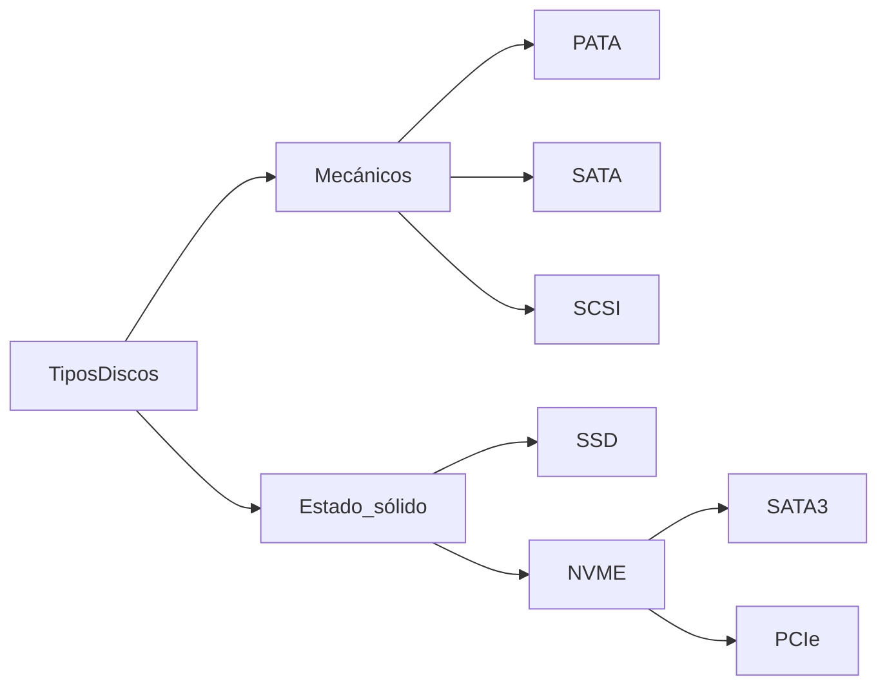
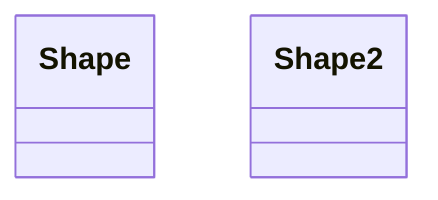

wProbas
"markdown.styles": [
    "https://use.fontawesome.com/releases/v5.7.1/css/all.css"
]

Documentación: https://code.visualstudio.com/Docs/languages/markdown#_using-your-own-css 





Diagrama de clases



```mermaid
erDiagram
    MODULO ||--o{ matricula : cursase
    MODULO {
        int numExpediente PK "Numero de expediente académico"
        Date fechaNacimiento
        string nome
        string apelido1
        string apelido2
    }
    ALUMNO ||--o{ matricula : inscribese
    ALUMNO {
        string codigo PK "Código do módulo"
        string Nome
        string Descripcion
        int horas
    }

    ```

Gráficas

```mermaid
pie title Pets adopted by volunteers
    "Dogs" : 386
    "Cats" : 85
    "Rats" : 15
```