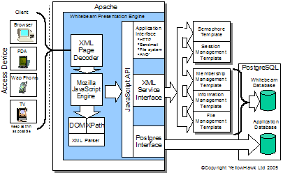

Whitebeam é unha tecnoloxía madura e libre (licenza **BSD**) que vén de acadar a súa versión 1.1.5.

Combina XML e JavaScript con PostgreSQL para que o teu servidor forneza aplicacións ricas en funcionalidades co que se convertir nunha sólida alternativa á **LAMP** (Linux/mySQL/PHP).

Podes obter este software [en SourceForge](http://sourceforge.net/projects/whitebeam), acceder a ler a súa abundante [documentación](http://www.whitebeam.org/overview/doc.rhtm) desde a páxina principal de [Whitebeam](http://www.whitebeam.org/) e ollar en que basea a súa [tecnoloxía](http://www.whitebeam.org/overview/architecture.rhtm).Fonte: [agnix.org](http://agnix.org)
