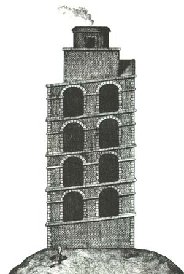

Seguro que moitos non saben que A Estrada e a Torre de Hércules teñen ligazóns históricas. Pois ambas foron parte dun troco entre o Rei Alfosno VII e o Arcebispo Xelmirez.

Alfonso VII naceu en Padrón en 1105. Era rei de Castela e León, e entre as terras que dependían directamente do reino figuraban as de Tabeirós e contorna.

O superobispo Diego Gelmírez, pola súa banda, tiña entre as súas moitas competencias e territorios que debía administrar á Torre de Hércules, que contaba entón cunha fortaleza.

O mantemento de devanditas instalacións militares debía de saírlle moi caro a Gelmírez, que prefería ampliar, con terras interiores e pacíficas, a súa arquidiocese. Pola súa banda, ao rei interesáballe controlar directamente as fortalezas defensivas.

O caso é que se puxeron a negociar, e o acordo non foi outro que un intercambio. As terras de Tabeirós pasaron a depender de Gelmírez, e Alfonso VII quedou coa torre e fortaleza.

Nin naqueles anos, nin nos séculos posteriores existiu a denominación da Estrada para estas terras, nin o concepto de concello ou municipio actual para as mesmas. Non foi ata mediados do século XIX cando se unificaron uns cotos territoriais, e A Estrada pasou a ser un municipio, con capitalidade na vila. Neses anos o que é hoxe a vila non era máis que unha aldea que estaba crecendo. As casas aliñábanse xunto a un camiño, desde a zona da rúa Matadoiro para seguir pola actual Castelao, A Farola e O Cruceiro.

Ligazóns de interese:

- [Galipedia - Torre de Hércules](http://gl.wikipedia.org/wiki/Torre_de_H%C3%A9rcules)
- [INVESTIGACIONES SOBRE LA FUNDACIÓN Y FÁBRICA DE LA TORRE LLAMADA DE HÉRCULES, SITUADA A LA ENTRADA DEL PUERTO DE LA CORUÑA](http://www.estudioshistoricos.com/articulo/jlv/jlv_08.htm)
- [http://www.torrehercules.org](http://www.torrehercules.org)
- [Alfonso VII cedeu a zona da Estrada a Gelmírez pola Torre de Hércules](http://www.lavozdegalicia.es/deza/2007/12/13/0003_6398523.htm?idioma=galego "Torre de Hércules + A Estrada")
