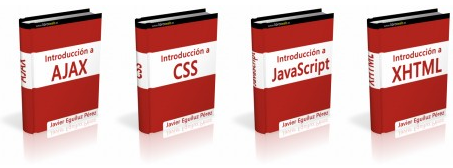

Fai un mes publiquei un lista de manuais de linguaxes que se empregan para facer web's hoxe, tocalle a unha web [**LibrosWeb.es**](http://librosweb.es/) publica gratuitamente baixo licenza Creative Commons libros de diseño web e traduccións de libros gratuitos relacionados co deseñe e a programación web.

Podes comenzar por ler estos libros de manera online.
