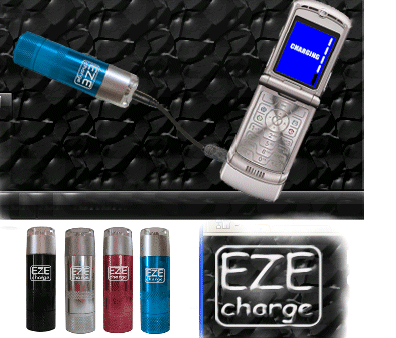

EZE charger é un sinxelo cargador de urxencia para teléfonos móbiles, capaz de ofrecer enerxía suficiente para uns minutos en caso de necesidade.

EZE Charger é pequeno, funciona cunha simple pila AA, que mediante un adaptador únese ao conector de carga do noso teléfono móbil nuns minutos, ofrecendo carga suficiente para utilizalo "ata 2 horas".

O Kit do EZE Charger, fabricado por Pinnacle Innovations, vén con 2 adaptadores de Nokia, 2 de Motorola, 1 de Samsung, 2 de Siemens, 2 de Sony Eriksson e 1 de LG, ademais de con unha bolsa para todos eles, debido á tolemia de conectores diferentes que teñen hoxe en día os teléfonos móbiles no mercado.

A empresa deixa claro que se trata dunha solución de urxencia, que sempre debe utilizarse o cargador orixinal do fabricante do teléfono. Custa uns 9 euros, máis outros 5 de gastos de envío, e véndese (en principio para Reino Unido) desde http://www.eze-charge.co.uk
