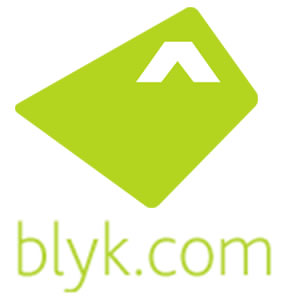

Blyk é unha operadora de telefonía móbil exclusiva para as idades de 16 a 24 anos.

O que caracteríza esta compañía é que a primeira das redes de telefonía móbil, que é financiada coa publicidade. Os usuarios ao suscribense a rede van recibir publicidade que ao cambio tera unha cuota de mensaxes de texto e chamadas gratuitas ao mes, actualmente esta cuota é de 217 mensaxes e 43 minutos gratuitos.

Non existe un contrato, ou algún tipo de cuota mensual, se excedes a cuota asignada gratuira tes o teu saldo na tarxeta. Esta compañía que opera no Reino Unido ten as seguintes tarifas:

- SMS a : 10 pounds = 0.134 €uros
- Minuto chamada: 15 pounds = 0.20 €uros

Se esgotas o teu saldo simplemente tes que facer unha recarga no teu teléfono.

O rango de idade de 16-24 anos é excluinte, pero os membros que se une antes de pasar os 25 non son eliminados da rede, pero se o fan voluntariamente logo non poderán voltar.

Para afiliarte precisas unha invitación, que podes conseguir através de promocións especias e dos actuais membros. Os posíbeles membros que se une a rede pola web teñen dar unha serie de datos para ter o seu perfil e recibir publicidade. Como moito podes recibir 6 mensaxes publicitarias ao día, de momento anuncianse 44 empresas entre as que están Coca-cola, NatWest, Boots Group, Mastercar, .....

Esperemos que unha compañia semellante chegue a operar e ofrezca servizos semellantes que eu sería dos primeiros clientes.
