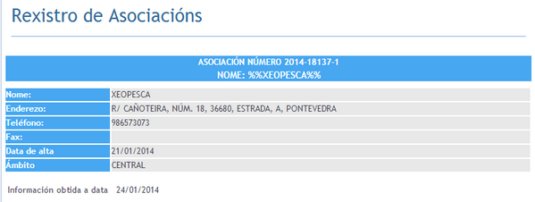

O pasado 21 de xaneiro a Xunta de Galicia deu de alta e validou os [Estatutos da Asociación XeoPesca](http://xeopesca.com/wp-content/uploads/2014/01/estatutos.pdf)  como asociación de software libre.

Rexistro de Asociacions Xunta de Galicia

Esta primeira directiva esta formada polo magnífico equipo:

- Presidente: Pablo Belay (Quen inconscientes de escollerme a min xD)
- VicePresidente: [Miguel A. Rodríguez Luaces](http://www.linkedin.com/profile/view?id=36827864) (gran profesor e mentor)
- Secretario: [Xosé Rial](http://www.linkedin.com/profile/view?id=152349897)
- Tesoureiro: [Pablo Argibay](http://www.linkedin.com/profile/view?id=43438912) 
- Vocal 1: [Aitor Gaspar Romero](http://www.linkedin.com/profile/view?id=240445696)
- Vocal 2: [Rut Devesa Arnoso](http://www.linkedin.com/profile/view?id=133557926)

Tamén destacar a labor de Emiliano Goday, Cristina Benavides, David Belay, Javier Alonso, Fran Martinez Hidalgo,... e  moitos mais como a xente da Fundacion LonxaNet, os investigadores do CSIC de Vigo.
