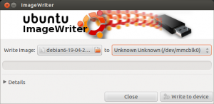

Dende fai uns meses merquei unha Raspberry Pi para empezar fedellar, varios amigos me comentaron como fixera para instalar raspbian e asi que aprobeito para facer esta entrada explicatoria.

**PASO 1. Que precisas:**

- Unha tarxeta SD (4GB ou máis) ([click no enlace para ver se a súa tarxeta SD é soportado](http://elinux.org/RPi_VerifiedPeripherals#SD_cards))
- A imaxen da útlima versión de Raspbian (descargar aquí)
- Un equipo con Linux ou Windows
    - Se empregas Linux deberás baixarte o ___`usb-imagewrite`___ `` `sudo apt-get install usb-imagewriter gparted` ``
    - Se empregas Windos: Deberías baixarte o  Win 32 disk imager ([Descargar aquí](https://launchpad.net/win32-image-writer))

**PASO 2. Como instalar en Debian**

- Executas o programa para montar a imaxen na tarxeta _sudo imagewriter_
- Seleccione a imaxe que descargaches e o dispositivo de destino, 

**PASO 3. Como instalar en windows**

- Executas o programa Win 32 disk imager
- Seleccione a imaxe que descargaches e o dispositivo de destino. 

 

 

 

 

 

 

**PASO 4.** Arrincar a raspberry coa SD raspbianizada xD

Noutra entrada comentarei algo mais sobre como configurar a raspbian.

