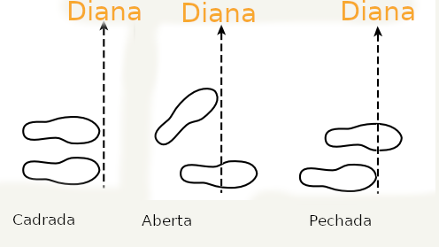

No tiro con arco, a elección da postura inflúe directamente na estabilidade, precisión e comodidade do arqueiro. Existen diferentes tipos de posturas, cada unha con vantaxes e desvantaxes específicas segundo a morfoloxía e a técnica do tirador.

A postura cadrada destaca pola súa naturalidade e facilidade de reprodución, pero ofrece unha base de apoio limitada e pode xerar inestabilidade en condicións de vento. A postura aberta, pola súa banda, proporciona unha base de apoio máis estable e mellora a distancia coa corda, aínda que pode inducir unha maior rotación do torso e un uso excesivo do brazo no tensado do arco. Por último, a postura pechada favorece unha boa aliñación do corpo co obxectivo, aínda que reduce a distancia coa corda e pode aumentar a tendencia a sobre-tensar ou afastarse do obxectivo.

| Tipo de postura | Vantaxes | Desvantaxes |
|---------------|----------|-------------|
| **Cadrada** | - Posición natural    - Fácil de replicar | - Base de apoio pequena no plano frontal-traseiro    - O corpo pode balancearse, especialmente en condicións de vento    - Minimiza a distancia coa corda, especialmente para tiradores con peito grande |
| **Aberta** | - Proporciona unha base de apoio estable    - Minimiza a tendencia a inclinarse lonxe do obxectivo    - Proporciona máis distancia coa corda que outras posturas | - Promove a tendencia a xirar a parte superior do corpo cara ao obxectivo    - Promove a tendencia a usar máis o brazo que os músculos das costas para tensar o arco |
| **Pechada** | - Proporciona unha base de apoio estable    - Promove unha boa aliñación do brazo e do ombreiro en liña directa co obxectivo | - Minimiza a distancia coa corda; a corda pode golpear o corpo ou a roupa    - Promove a tendencia a inclinarse lonxe do obxectivo ou a sobre-tensar |

Fonte: Archery Steps To Sucess de Kathleen Haywood e Catherine Lewis. 

